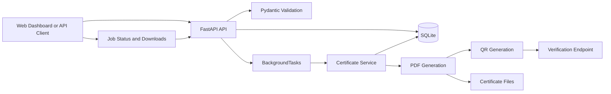

# CertiFlow — Bulk Certificate Generator API

[](https://github.com/Eternity2401/Bulk-Certificate-Generator)
[](https://python.org)
[](https://fastapi.tiangolo.com)
[](https://opensource.org/licenses/MIT)

CertiFlow is a lightweight backend API service built with FastAPI that generates PDF certificates in bulk from a predefined template, tracks generation progress asynchronously, isolates individual recipient failures, and provides QR-based certificate verification.

---

## 🌟 Features

- **Bulk Certificate Generation**: Accepts a list of recipients along with course metadata in a single request and returns an immediate job handle.
- **Background Processing**: Uses FastAPI `BackgroundTasks` to process certificate generation asynchronously without blocking client requests.
- **Isolated Failure Handling**: If an individual certificate fails to generate, remaining valid certificates in the batch continue processing.
- **PDF Certificate Generation**: Generates landscape PDF certificates using ReportLab with custom typography and borders.
- **QR-Based Verification**: Embeds a unique certificate ID and QR code in each PDF linking to a verification endpoint and web page.
- **Job Status & Progress Tracking**: Real-time progress monitoring with completion counters (`completed`, `failed`, `pending`) and per-item statuses.
- **Flexible Downloads**: Supports downloading individual PDF certificates as well as downloading all successful certificates in a single ZIP archive.
- **Interactive Web Dashboard**: Built-in web UI with manual entry, CSV import, real-time polling progress bar, and certificate download links.

---

## 🛠️ Tech Stack

- **Backend Framework**: FastAPI
- **Data Validation**: Pydantic v2
- **Database & ORM**: SQLite with SQLAlchemy 2.0
- **PDF Generation**: ReportLab
- **QR Code Generation**: qrcode + Pillow
- **Frontend / Templates**: Jinja2 + HTML / CSS / Vanilla JavaScript
- **Testing**: Pytest + HTTPX
- **CI / Deployment**: GitHub Actions, Docker, Render

---

## 🏗️ Architecture



### Processing Flow:
1. **Submit Request**: Client posts course details and recipient list to `/api/v1/certificates/generate`.
2. **Validate & Accept**: Pydantic validates the payload; records are created in SQLite with `PENDING` status; API returns HTTP `202 Accepted` with a `job_id`.
3. **Background Worker**: `BackgroundTasks` invokes the certificate service to iterate through recipients.
4. **Isolated Generation**: For each recipient, a unique certificate ID is assigned, a verification QR code is generated, and a PDF is rendered. Errors on individual items are recorded without stopping the batch.
5. **Completion**: Job status updates to `COMPLETED` (all succeeded) or `COMPLETED_WITH_ERRORS` (partial success).
6. **Retrieval & Verification**: Certificates can be downloaded individually or as a batch ZIP archive, and verified via QR code scan or verification URL.

---

## 🗄️ Database Design

The database uses SQLite with two main tables:

- **`jobs`**: Tracks bulk generation jobs, metadata (course name, issue date), overall status (`PENDING`, `PROCESSING`, `COMPLETED`, `COMPLETED_WITH_ERRORS`, `FAILED`), and completion counters (`total_count`, `success_count`, `failed_count`).
- **`certificate_items`**: Tracks individual recipients within a job, unique `certificate_id`, processing status (`PENDING`, `PROCESSING`, `COMPLETED`, `FAILED`), output `file_path`, and any `error_message` if generation failed.

---

## 📂 Project Structure

```
bulk-certificate-generator/
├── app/
│   ├── main.py                     # FastAPI application entrypoint & middleware
│   ├── config.py                   # Settings & configuration management
│   ├── api/
│   │   └── routes.py               # REST API endpoints & HTML template routes
│   ├── db/
│   │   ├── database.py             # Database connection & session setup
│   │   └── models.py               # SQLAlchemy models (Job, CertificateItem)
│   ├── schemas/
│   │   └── certificate.py          # Pydantic validation schemas
│   ├── services/
│   │   ├── certificate_service.py  # Background job orchestrator & error handler
│   │   ├── pdf_service.py          # ReportLab PDF certificate template
│   │   └── qr_service.py           # QR code generation service
│   ├── templates/
│   │   ├── dashboard.html          # Web UI dashboard template
│   │   └── verify.html             # Certificate verification web page
│   └── static/
│       ├── style.css               # Dashboard styling
│       └── app.js                  # Frontend form handling & polling logic
├── certificates/                   # Directory for generated PDF files
├── sample_data/
│   ├── sample_recipients.csv       # Sample CSV file for bulk import
│   └── sample_request.json         # Sample JSON request payload
├── tests/
│   ├── conftest.py                 # Test fixtures & test client setup
│   ├── test_api.py                 # API integration tests
│   ├── test_generation.py          # PDF & QR generation unit tests
│   └── test_validation.py          # Input validation tests
├── .github/
│   └── workflows/
│       └── ci.yml                  # GitHub Actions CI workflow
├── .env.example                    # Environment variables template
├── Dockerfile                      # Docker container definition
├── pytest.ini                      # Pytest configuration
├── render.yaml                     # Render deployment configuration
├── requirements.txt                # Project dependencies
├── run.py                          # Application startup script
├── start.bat                       # Windows startup script
├── test.bat                        # Windows test runner script
└── README.md                       # Project documentation
```

---

## 🚀 Setup & Installation

### Prerequisites
- Python 3.11+
- Git

### 1. Clone the Repository
```bash
git clone https://github.com/Eternity2401/Bulk-Certificate-Generator.git
cd Bulk-Certificate-Generator
```

### 2. Create and Activate Virtual Environment
```bash
# Linux / macOS
python3 -m venv venv
source venv/bin/activate

# Windows (PowerShell)
python -m venv venv
.\venv\Scripts\Activate.ps1
```

### 3. Install Dependencies
```bash
pip install -r requirements.txt
```

### 4. Configuration (Optional)
Copy `.env.example` to `.env` to customize settings:
```bash
# For local development:
BASE_URL=http://localhost:8000

# For deployed service:
# BASE_URL=https://<your-render-service>.onrender.com
```

---

## 💻 Running Locally

### Start Server
```bash
python run.py
```
*(Alternatively on Windows: double-click `start.bat`)*

### Access Endpoints:
- **Web Dashboard**: `http://localhost:8000`
- **Interactive Swagger Docs**: `http://localhost:8000/docs`
- **ReDoc Documentation**: `http://localhost:8000/redoc`
- **Health Check**: `http://localhost:8000/health`

---

## 🧪 Testing

The test suite includes **17 tests passing**, covering:
- Bulk job creation and accepted response
- Recipient input validation (empty list, blank names, malformed email)
- Asynchronous certificate generation and job completion
- Isolated individual failure handling (`COMPLETED_WITH_ERRORS`)
- ReportLab PDF generation and file signature verification
- QR code generation and verification URL formatting
- Individual certificate download (`application/pdf`)
- Batch ZIP archive download (`application/zip`)
- Public verification endpoint (JSON response and HTML badge)
- Health check and 404 missing resource handling

Run tests with:
```bash
python -m pytest
```
*(Alternatively on Windows: double-click `test.bat`)*

---

## 📡 API Reference

| Method | Endpoint | Description |
| :--- | :--- | :--- |
| `POST` | `/api/v1/certificates/generate` | Submit bulk certificate generation request |
| `GET` | `/api/v1/certificates/jobs/{job_id}` | Check job status, progress, and recipient items |
| `GET` | `/api/v1/certificates/{item_id}/download` | Download individual generated PDF certificate |
| `GET` | `/api/v1/certificates/jobs/{job_id}/download-all` | Download all certificates for a job as a ZIP |
| `GET` | `/api/v1/certificates/verify/{certificate_id}` | Verify certificate authenticity (JSON / HTML) |
| `GET` | `/health` | Service health check |
| `GET` | `/docs` | Interactive OpenAPI / Swagger UI |
| `GET` | `/redoc` | ReDoc API documentation |

### Example Request

#### Submit Generation Job:
```bash
curl -X POST http://localhost:8000/api/v1/certificates/generate \
  -H "Content-Type: application/json" \
  -d '{
    "course_name": "Full Stack Engineering",
    "issue_date": "October 7, 2026",
    "recipients": [
      { "name": "Alice Johnson", "email": "alice@example.com" },
      { "name": "Bob Smith", "email": "bob@example.com" }
    ]
  }'
```

#### Response (`202 Accepted`):
```json
{
  "job_id": "7f8b9e6c-31a2-4c9f-8d2b-1a9e8f7c6d5e",
  "status": "PENDING",
  "total_count": 2,
  "message": "Certificate generation job accepted and scheduled for background processing."
}
```

---

## ⚙️ Design Decisions

- **FastAPI**: Chosen for lightweight, high-productivity API development with automatic OpenAPI documentation and built-in asynchronous request handling.
- **SQLite**: Selected for simple, zero-setup local execution and demonstration without requiring an external database server.
- **FastAPI BackgroundTasks**: Used for background generation so the API can return an immediate job ID while PDF rendering continues asynchronously.
- **Independent Recipient Processing**: Each recipient is processed in an isolated try-except block so that a failure in one item does not block or terminate the entire batch.
- **File Storage + Database Metadata**: Generated PDFs are stored on disk while metadata, paths, and status counters are tracked in SQLite.

---

## ☁️ Render Deployment

This project is configured for deployment on Render's Free Web Service:

1. Push the repository to GitHub.
2. Create a new **Web Service** in [Render](https://render.com) and connect the repository.
3. Configure:
   - **Environment**: `Python 3`
   - **Build Command**: `pip install -r requirements.txt`
   - **Start Command**: `uvicorn app.main:app --host 0.0.0.0 --port $PORT`
   - **Plan**: `Free`
4. Set Environment Variable:
   - `BASE_URL`: `https://<your-render-service>.onrender.com`

> **Note**: Free cloud hosting is intended for demonstration and portfolio use. Local SQLite and filesystem storage are ephemeral and reset on service restarts.

---

## 🔮 Future Improvements

- **PostgreSQL**: Transition to PostgreSQL for multi-instance deployments.
- **Cloud Object Storage**: Store generated PDFs in Amazon S3 or Google Cloud Storage for persistent, scalable file storage.
- **Durable Task Queue**: Introduce Redis/Celery for distributed task management across multiple worker nodes.
- **Authentication**: Add API key or JWT-based authentication for tenant-specific access.

---

## 📄 License

This project is licensed under the MIT License. See the [LICENSE](LICENSE) file for details.
